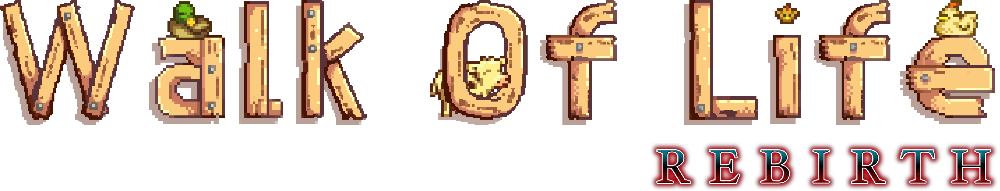
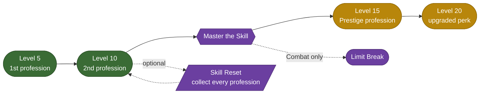

<div align="center">



<br>
<br>

<!-- BADGES -->
[](https://www.nexusmods.com/stardewvalley/mods/24355)
[%5D%5B1%5D&label=downloads&color=da8e35&logo=nexusmods&logoColor=white)](https://www.nexusmods.com/stardewvalley/mods/24355)
[](https://www.stardewvalley.net/)
[](https://smapi.io/)
[](https://github.com/daleao/sdv/releases)
[](https://github.com/daleao/sdv/blob/main/LICENSE.md)
[](https://github.com/daleao/sdv/stargazers)

***An extensive overhaul of Stardew Valley's skill progression and profession trees.***

<!-- NAV -->
[**⬇ Nexus Mods**](https://www.nexusmods.com/stardewvalley/mods/24355) &nbsp;•&nbsp; [**📖 Wiki**](https://stardewvalleywiki.com/) &nbsp;•&nbsp; [**🐛 Report a Bug**](https://github.com/daleao/sdv/issues) &nbsp;•&nbsp; [**💾 Source Code**](https://github.com/daleao/sdv/tree/main/Professions)

<br>


&nbsp;

&nbsp;

&nbsp;

&nbsp;


</div>

<a id="top"></a>
<!-- TABLE OF CONTENTS -->
<details open="open" align="left">
<summary><b>Table of Contents</b></summary>
<ol>
	<li><a href="#what-this-is">What This Is</a></li>
	<li>
		<a href="#the-professions">The Professions</a>
		<ol>
			<li><a href="#farming">Farming</a></li>
			<li><a href="#foraging">Foraging</a></li>
			<li><a href="#mining">Mining</a></li>
			<li><a href="#fishing">Fishing</a></li>
			<li><a href="#combat">Combat</a></li>
		</ol>
	</li>
	<li>
		<a href="#skill-progression-tropes">Skill Progression Tropes</a>
		<ol>
			<li><a href="#profession-change-skill-reset">Profession Change Skill Reset</a></li>
			<li><a href="#prestige-professions">Prestige Professions</a></li>
			<li><a href="#limit-breaks">Limit Breaks</a></li>
		</ol>
	</li>
	<li><a href="#misc-changes">Misc. Changes</a></li>
	<li><a href="#compatibility">Compatibility</a></li>
	<li><a href="#credits--special-thanks">Credits &amp; Special Thanks</a></li>
	<li><a href="#for-mod-authors">For Mod Authors</a></li>
	<li><a href="#faq">F.A.Q.</a></li>
</ol>
</details>


<a id="what-this-is"></a>
## 📖 What This Is

This mod is an extensive overhaul of the skill progression and profession tree systems. It replaces the unbalanced and rather *boring* vanilla professions with more unique and impactful choices. The goal is not to re-optimize gold-making potential, but to expand the gameplay and encourage new experiences.

Optionally, this mod also brings classic progression tropes like [Prestige Classes](https://tvtropes.org/pmwiki/pmwiki.php/Main/PrestigeClass), [Class Change Level Reset](https://tvtropes.org/pmwiki/pmwiki.php/Main/ClassChangeLevelReset), and [Limit Breaks](https://tvtropes.org/pmwiki/pmwiki.php/Main/LimitBreak). Prestige Professions and Limit Breaks are enabled by default, while Class Change Skill Reset is disabled by default; all can be toggled in the settings.

This module was inspired by such great overhaul mods as [Enai Siaion][user:enai]'s [Ordinator][mod:ordinator] for Skyrim and [ReaperAnon](user:reaperanon)'s [Witcher 3 Enhanced Edition](mod:w3ee). It borrows many ideas and assets from the classic [Ragnarok Online][url:ragnarok], and also includes new improved profession icons by [IllogicalMoodSwing][user:illogicalmoodswing] (**please visit and endorse [Profession Icons Redone](mod:icons-redone)!**).

### Progression at a Glance



<sup><sup>[🔼 Back to top](#top)</sup></sup>


<a id="the-professions"></a>
## ⚔️ The Professions

Click on any profession below to expand for more details. Golden professions refer to [Prestige Professions](#prestige-professions) variants.

> [!TIP]
> I strongly recommend reading every profession fully, as the in-game descriptions offer limited space and most professions have additional features that are not mentioned in their descriptions.

**How to read this section:** each skill unlocks a **Level 5** profession and a **Level 10** profession; mastering the skill then unlocks a golden **Prestige** upgrade at Levels 15 & 20. A <s>strikethrough</s> in a golden line means the base perk is being *replaced/upgraded*, not stacked.

<a id="farming"></a>
###  Farming

| | Lv 5 / Lv 10 | ✨ Prestige (Lv 15 / Lv 20) |
| :--: | :-- | :-- |
|  | **Harvester** — extra crop yield | **Master Harvester** — bigger chance |
|  | **Agriculturist** — faster growth, organic quality | **Cropwhisperer** — crop rotation & out-of-season |
|  | **Artisan** — machine calibration & quality | **Machinist** — batteries & curing treatments |
|  | **Rancher** — feed crops for nutrition | **Master Rancher** — silo auto-feeding |
|  | **Breeder** — faster breeding & bloodlines | **Progenitor** — unlimited bloodlines |
|  | **Producer** — faster produce, full-barn bonus | **Prolific** — even faster produce |

<details>
<summary> <b>Farming — click to expand all professions</b></summary>

<ul>

<!--- Harvester --->

<details>
<summary> <b>Harvester (Lv5)</b> - 10% chance for extra yield from harvested crops.
</summary>

<ul>

<font color="gold">
 <b>Master Harvester (Lv15)</b> - <s>10%</s> → 20% chance for extra yield from harvested crops.
</font>

<font size="2">
<details>

Equivalent in value to vanilla's 10% price bonus on average, but also provides value if you don't sell raw crops.
</details>
</font>

</ul>
</details>

<!--- Agriculturist --->

<details>
<summary> <b> Agriculturist (Lv10)</b> - Crops grow 10% faster, plus 5% for each new crop type grown in the same tile and season. Highest-quality crops can be harvested organically, without fertilizers.
</summary>

<ul>

<font color="gold">
 <b>Cropwhisperer (Lv20)</b> - Chance to harvest crops grown previously in the same tile and season. Use Retaining Soil to grow crops out of season.
</font>

<font size="2">
<details>

Every tilled tile keeps a memory of the previous crops grown on that tile in the current season. For each unique crop in that memory, the *next* crop gains 5% bonus to growth speed. If prestiged, each crop in memory also has a chance to be harvested as a bonus yield. Chance is 20% for the most recent crop, and decreases by 2x for each subsequent crop (10% / 5% / 2.5%). Caps out at 4 crops.

Soil memory resets on the 1st of every season, and is completely lost if the hoe dirt disappears (whether from using a Pickaxe or left unplanted).

**Highest-quality** refers to iridium, which normally requires Deluxe Fertilizer. The chance is very small; about 7% at level 10, without fertilizers. Deluxe Fertilizer increases that to about 40% at level 10. Fertilizers are still very useful.
Note that quality is determined only on the moment of harvest; planted crops have no quality, which means that this perk will apply to crops planted before obtaining this profession.

When prestiged, Retaining Soil can be used to either extend a crop's lifespan into the next season, or even to grow a whole crop out of season. Each quality of Retaining Soil allows a single tile to sustain an out-of-season crop for a limited number of days:

| Retaining Soil | Days out of season |
| --- | --- |
| **Basic** | 3 days |
| **Quality** | 7 days |
| **Deluxe** | 13 days |

Any crop that fully grows within that time can be harvested as normal despite being out of season.

Retaining Soil can be used to extend a crop's lifetime into the winter season, but **cannot be used to plant crops during winter**.

</details>
</font>

</ul>
</details>

<!--- Artisan --->

<details>
<summary> <b>Artisan (Lv10)</b> - Artisan machines calibrate to repeated ingredients, progressively reducing process time. Chance to preserve ingredient quality when fully calibrated.
</summary>

<ul>

<font color="gold">
 <b>Machinist (Lv20)</b> - Machines calibrated twice as quickly. Enhance machines with batteries and curing agents to further boost processing speed or output quality.
</font>

<font size="2">
<details>

**Calibration** is very straightforward:
- Each time the same ingredient is processed consecutively, the following production cycle requires 2.5% less time.
- This caps after 10 cycles, after which the machine becomes "fully-calibrated", and production time is reduced by 25%.
- If at any moment the machine receives a different item, the calibration drops down to zero and starts over.
- Only the item ID is checked. Quality is ignored.
- This is tied to the individual machine, and not the user; as long as the machine was crafted by an Artisan, this will work regardless of who uses the machine (ownership requirements can be disabled in config settings).
- When Prestiged, a fully-calibrated machine will immediately yield an additional low-quality output after every 5 repeated cycles (works with [Two-Way Hopper](../Core/README.md)).

**Quality preservation:**
- ...is based on your Farming level. There is a `FarmingLevel / 60`% chance to fully preserve the ingredient's quality. If this fails, quality drops by 1 stage, and the game makes another check at `FarmingLevel / 30`. If this also fails, quality drops again by 1 stage. If starting with Iridium ingredients, then the output is guaranteed to be at least Silver quality.
- ...is tied to the Artisan player, and not the machine. This means that only Artisan players can preserve ingredient quality, and they can do so on any machine, even those crafted by non-Artisan players.

**Prestige (machine treatments):**
- Machines can receive four types of treatments:
    - **Fermentation treatment** is performed by coating the inside of a machine with Oak Resin. Just as wines and spirits are traditionally aged in oak barrels, a resin-treated vessel gradually imparts subtle woody notes while creating a more favorable environment for fermentation. This treatment improves the quality of fermented products such as wine, beer, mead, cheese, pickles, and other cultured foods.
    - **Glazing treatment** is performed by coating the inside of a machine with a sweet, viscous syrup such as Maple Syrup. The seasoned surfaces enhance the natural sweetness and aroma of fruits and other ingredients while making juices, jams and other confectures. *If SVE is installed, Birch Syrup may also be used.*
    - **Sealing treatment** is performed by applying a thick greese like Pine Tar to seal tiny gaps and condition working surfaces. Like well-seasoned pan or smoker, this improves heat retention and reduces product loss, which supports the manufacturing of oils, waxes and dried goods, while also enhancing the flavor of certain smoked meats. *If SVE is installed, Fir Wax may also be used.*
    - **Overclocking treatment** is performed by fitting a machine with an electronic controller powered by a Battery Pack. The controller safely pushes the machine beyond its normal operating limits, dramatically increasing processing speed until the battery is exhausted. Unlike other treatments, overclocking works with any artisan machine.
- Any machine can be treated with overclocking plus one respectve coating treatment at the same time. A coating treatment lasts for 20 cycles, and is guaranteed to promote the quality of the output by one stage. An overclock treatment lasts for 30 cycles and will double production speed.
- Treatments are applied by interacting with a machine while holding the treatment item. If a different coating is applied, it overwrites the previous one.
- Treatments are automatically applied by Hoppers.

**Other:**
- In order to maintain the consistency of this profession, this mod also adds two additional optional changes:
    1. Large Eggs and Large Milk yield double amounts of regular-quality Mayo and Cheese respectively, instead of increasing each to gold-quality.
    2. Adds Ostrich and Golden Mayo items, replacing the weird vanilla rules that normally apply to Ostrich and Golden eggs. Blue Mayo is not included.
- Both options above are enabled by default.

</details>
</font>

</ul>
</details>

<!--- Rancher --->

<details>
<summary> <b>Rancher (Lv5)</b> - Animals can be fed certain crops to supplement nutrition and increase friendship.
</summary>

<ul>

<font color="gold">
 <b>Master Rancher (Lv15)</b> - Crops placed in a Silo are distributed by feed hoppers. Friendship with animals builds twice as quickly.
</font>

<font size="2">
<details>

**Crop Feeding:** Animal species can eat certain crops. Once per day, you can feed an animal their favored crop to improve, in addition to friendship, it's short-term and long-term nutrition; two hidden stats that will be relevant to the next professions. **Short-term** nutrition increases by 25 per feeding, caps at 100, and decays by 10 on days where the animal is not fed (see Producer). **Long-term** nutrition increases by 10 per feeding, caps at 500 per generation (see Breeder), and never decays.

There is no trial and error or different levels of taste like villager NPCs; an animal will only accept the crop if it can eat it, and if it can eat it then it is favored. Quality makes no difference. You can track which animals have been fed in the Animals menu.

What each animal can eat is entirely configurable (see mod page Article). By default they eat:
- **Chickens + Ostriches:** Grains (like wheat, corn, rice), Legumes (beans), Fruits and Insects (bug meat).
- **Ducks:** Same as chickens, plus Greens (like cabbage, kale, cauliflower).
- **Cows + Sheep:** Greens and Legumes.
- **Goats:** Same as cows, plus Fruits.
- **Rabbits:** Greens, Roots (like beets, carrots, parsnips) and Fruits.
- **Pigs:** Almost anything; all of the above, plus Gourds (pumpkins, squash) and Tubers (potatos, yams).
- **Dino:** Grains, Greens, Gourds and Fruits.
- **Camels (SVE):** Grains, Legumes, Greens and Roots.
- **Geese (SVE):** Grains, Greens, Fruits and Insects.
- **Bears (SVE):** Fruits, Roots, Tubers, Gourds, Fish and Honey.

As you can see, the system is not actually limited to crops, though most animals are vegan.

**Prestige:** Interact with a Silo while holding a crop to store it. Just like Hay, crops will automatically be pulled and fed to the respective animals in buildings with a Feed Hopper.
</details>
</font>

</ul>
</details>

<!--- Breeder --->

<details>
<summary> <b>Breeder (Lv10)</b> - Halved incubation time and increased pregnancy chance. Animals with life-long supplemental nutrition build increasingly valuable bloodlines.
</summary>

<ul>

<font color="gold">
 <b>Progenitor (Lv20)</b> - Animal bloodlines can be improved further and without limitations. Deluxe Barn capacity +2.
</font>

<font size="2">
<details>

Animals you breed inherit the life-long nutrition of their mother. Inherited nutrition becomes their baseline, and does not contribute to its 1000 potential. This new baseline determined the animal's sale value; feeding the animal will not increase its value, but will increase its total nutrition, which can be passed on to the next generation, leading to better and better bloodlines.

An animal's sale value also decreases slowly over the years according to age and number of pregnancies or laid eggs. This will never decrease its value past the vanilla baseline. The optimal time to sell an animal is thus right when it hits maturity. Before prestige, there is a soft cap around ~10x vanilla price, which takes about 5 generations. After prestige, price can scale indefinitely.

Only affects animals born *after* obtaining this profession, though nutrition can be accumulated earlier.

This generates an actual gameplay loop; choose which animals to breed to maximize bloodline potential, and when to sell animals for maximum profit.

**Note about eggs:** An individual's inherited nutrition value is stored on each egg; if the player stacks eggs together, the individual information is lost. The mod will compute the mean nutrition of the final stack and assume that value for any egg taken from that stack, effectively diluting any very high-potential eggs. As such, if you're raising a high-potential chicken, keep its eggs separate from other stacks. Conversely, you can intentionally stack a bunch of eggs to ensure a newborn chick will inherit at least the mean potential of all chickens in a group.

**Bonus:** If you are a Breeder, your chickens above a certain nutrition threshold will have a very small chance to produce a Blue Egg naturally, which will hatch into a Blue Chicken.
</details>
</font>

</ul>
</details>

<!--- Producer --->

<details>
<summary> <b>Producer (Lv10)</b> - Happy animals produce 2x as frequently. Produce is worth 5% more for every full barn or coop.
</summary>

<ul>

<font color="gold">
 <b>Prolific (Lv20)</b> - Happy animals produce <s>2x</s> → 3x as frequently. Deluxe Coop capacity +2.
</font>

<font size="2">
<details>

Animals will progress through their production cycles twice as quickly on days where their short-term nutrition value is maxed at 100. This means that Ducks will lay eggs every day, and Ostriches will lay eggs every 4 days (rounds up). If the animal already produces daily, this does not cause it to produce twice per day.

If prestiged, the nutrition cap is raised to 200, and the animal's production cycle is doubled again while maxed out at that value, so Ostriches and Dinosaurs will lay eggs every 2 days.

Bonus value from full buildings also applies to artisan goods derived from animal products (such as cloth, cheeses, mayos), honey (configurable), and meats (not included). Oly deluxe buildings can be considered full, and only barns and coops owned (i.e., commissioned) by the Producer (ownership requirements can be turned off in the configs). SVE Premium buildings will also be considered, but they, too, must be full (i.e., must have 16 animals). If prestiged, this also includes the bonus 2 animal slots, which means that the bonus from coops will be temporarily lost until those extra slots are filled.

There is no upper limit to the price bonus.
</details>
</font>

</ul>
</details>

</ul>

</details>

<a id="foraging"></a>
###  Foraging

| | Lv 5 / Lv 10 | ✨ Prestige (Lv 15 / Lv 20) |
| :--: | :-- | :-- |
|  | **Forager** — double forage yield | **Master Forager** — bigger chance |
|  | **Ecologist** — healing forage & rising quality | **Bioharmonist** — forage grants buffs |
|  | **Scavenger** — reveal forage, treasure hunts | **Wayfarer** — frozen time & streak spawns |
|  | **Lumberjack** — more wood from trees | **Master Lumberjack** — even more wood |
|  | **Arborist** — faster trees, hardwood drops | **Silviculturist** — Green Rain on demand |
|  | **Tapper** — cheaper & faster tappers | **Syrupwright** — sap crafting, double syrup |

<details>
<summary> <b>Foraging — click to expand all professions</b></summary>

<ul>

<!--- Forager --->

<details>
<summary> <b>Forager (Lv5)</b> - 20% chance for double yield of foraged items.
</summary>

<ul>

<font color="gold">
 <b>Master Forager (Lv15)</b> - <s>20%</s> → 40% chance for double yield of foraged items.
</font>

<font size="2">
<details>

Other than the name, this profession is unchanged from vanilla.
</details>
</font>

</ul>
</details>

<!--- Ecologist --->

<details>
<summary> <b>Ecologist (Lv10)</b> - Foraged items restore 50% more health and energy. The quality of foraged items increases as new varieties are uncovered.
</summary>

<ul>

<font color="gold">
 <b>Bioharmonist (Lv20)</b> - Foraged items restore <s>50%</s> → 100% more health and energy and also afford buffs.
</font>

<font size="2">
<details>

All foraged items will have the same deterministic quality, providing immediate inventory convenience. But the quality initially starts at silver and progresses to iridium based on how many kinds of forage you have "studied". By default, requires 30 forage varieties to reach iridium, which is a number balanced for vanilla. This target can be increased via mod settings in case you have many mods adding new forage items. Only items foraged *after* obtaining the profession will be counted.

**Prestige:** A buff is chosen at random the first time a forage is consumed (eaten) since obtaining the prestige. That particular forage will henceforth always grant the same buff *for that player*, which will be indicated in the item's tooltip. If a different player in the multiplayer session also picks this prestige, their buffs will be different.
</details>
</font>

</ul>
</details>

<!--- Scavenger --->

<details>
<summary> <b>Scavenger (Lv10)</b> - Location of forageable items revealed. Occasionally detect buried treasures.
</summary>

<ul>

<font color="gold">
 <b>Wayfarer (Lv20)</b> - Time freezes during Scavenger Hunts. Find increasingly more forageables during a high Scavenger streak.
</font>

<font size="2">
<details>

Whenever you are outside there is a chance to trigger a **Scavenger Hunt** minigame:
- Works like a game of "hot-and-cold"; you must hoe the tiles around you and follow the cues until you find the treasure-containing tile before the time limit. Hoed tiles will point you in the right direction.
- If you are far away from the treasure tile, a purple tracking arrow will be displayed pointing you towards the general treasure vicinity.
- Rewards include smelted metal bars, artifacts, rare seeds and special equipment.
- If prestiged, building up a win streak will cause increased spawns of forage in every outdoors map. This uses your longest win streak instead of your current streak. 

You can also hold the mod key (default <kbd>Shift</kbd>) to highlight all forageable items currently on-screen for easier viewing.
There is a config option to prevent the tracking HUD arrows from being active all the time, and instead display only when holding that same mod key.

**Pointer colors:**
- 🟡 **Yellow:** Spawned forage items, blooming berry bushes, ginger, coconuts
- 🟢 **Green:** Artifact spots
- 🟣 **Purple:** Buried treasure (Scavenger Hunt only)
</details>
</font>

</ul>
</details>

<!--- Lumberjack --->

<details>
<summary> <b>Lumberjack (Lv5)</b> - Felled trees yield 25% more wood.
</summary>

<ul>

<font color="gold">
 <b>Master Lumberjack (Lv15)</b> - Felled trees yield <s>25%</s> → 50% more wood.
</font>

<font size="2">
<details>

Other than the name, this profession is unchanged from vanilla.
</details>
</font>

</ul>
</details>

<!--- Arborist --->

<details>
<summary> <b>Arborist (Lv10)</b> - Planted trees grow 25% faster. All trees have a chance to drop hardwood.
</summary>

<ul>

<font color="gold">
 <b>Silviculturist (Lv20)</b> - All trees can drop even more hardwood. The Green Rain may fall in any season if Green Rain Trees are grown on the farm.
</font>

<font size="2">
<details>

Applies to both common trees and fruit trees. Note that common trees grow randomly, and so gain 25% bonus chance to advance a stage each night. Fruit trees, on the other hand, grow on a fixed schedule, in which case the perk simply causes every 4th day to be skipped so as to preserve that predictable nature.

**Prestige:** As long as at least one Green Rain Tree grows on the farm, there is a 10% base chance to convert any rainy weather, even those caused by Rain Totems, into Green Rain, plus 2% for each fully-grown Green Rain Tree, up to a maximum of 50%.
</details>
</font>

</ul>
</details>

<!--- Tapper --->

<details>
<summary> <b>Tapper (Lv10)</b> - Tappers are cheaper to craft. Tapped trees produce syrup 25% faster.
</summary>

<ul>

<font color="gold">
 <b>Syrupwright (Lv20)</b> - Tapped trees produce syrup <s>25%</s> → 50% faster. Can replace crafting ingredients with sap and double the yield of recipes that consume syrup.
</font>

<font size="2">
<details>

New regular recipe: x20 wood, x1 copper bar.
New Heavy recipe: x15 hardwood, x1 radioactive bar.

In order to avoid redundancy with Heavy Tappers and maintain balance, this mod optionally changes Heavy Tapper to produce at the same speed as regular Tapper, but instead double the yield, which makes it more in line with the new Heavy Furnace and, honestly, just makes more sense. This is enabled by default.

**Prestige:** Hold the Mod key (default <kbd>Shift</kbd>) in the crafting menu while hovering any recipe to enter "sap" mode; you can replace any crafting ingredient in the recipe with sap, as long as the recipe has more than one ingredient, and doesn't already use sap. If the recipe uses a syrup, then only the syrup can be replaced, but doing so will forfeit the "double yield" part of the perk. Note that the vanilla game uses <kbd>Shift</kbd> as a batch key, which allows crafting 5x at a time. If the Mod key is also <kbd>Shift</kbd>, then vanilla's batch key will be swapped to <kbd>Ctrl</kbd> (and vice versa).

> **📝 Note — Better Crafting + Gamepad:** Although controller input is supported, Better Crafting's menu uses every single button on a normal controller, so it's effectively impossible to trigger because there's no free button to use as the Mod / trigger. So if you play with both BC and gamepad, use it's keybind to open the vanilla crafting menu, and then you'll be able to use these profession features through there.
</details>
</font>

</ul>
</details>

</ul>

</details>

<a id="mining"></a>
###  Mining

| | Lv 5 / Lv 10 | ✨ Prestige (Lv 15 / Lv 20) |
| :--: | :-- | :-- |
|  | **Miner** — +1 ore per vein | **Master Miner** — +2 ore per vein |
|  | **Spelunker** — Momentum, ladder & ore chance | **Cavewarden** — Survey Flag checkpoints |
|  | **Prospector** — reveal nodes, treasure hunts | **Relicseeker** — frozen time & streak veins |
|  | **Blaster** — more explosives & coal | **Master Blaster** — even more coal |
|  | **Demolitionist** — bigger bombs, more drops | **Pyrotechnician** — chain reactions |
|  | **Gemologist** — paired gems, rising quality | **Crystallographer** — tripled gems, replicas |

<details>
<summary> <b>Mining — click to expand all professions</b></summary>

<ul>

<!--- Miner --->

<details>
<summary> <b>Miner (Lv5)</b> - +1 ore per ore vein.
</summary>

<ul>

<font color="gold">
 <b>Master Miner (Lv15)</b> - <s>+1</s> → +2 ore per ore vein.
</font>

<font size="2">
<details>

This profession is completely unchanged from vanilla.
</details>
</font>

</ul>
</details>

<!--- Spelunker --->

<details>
<summary> <b>Spelunker (Lv10)</b> - Mining without resurfacing builds Momentum; increases ladder chance and can be spent to recover energy. After finding a ladder, Momentum decays, but stones can drop ore.
</summary>

<ul>

<font color="gold">
 <b>Cavewarden (Lv20)</b> - Craft and place a Survey Flag to establish a checkpoint with several benefits. While Momentum decays, stones can drop even more ore.
</font>

<font size="2">
<details>

Gain 5 stacks of Momentum each time you go down a level in the Mines or Skull Caverns. Each stack adds 0.05% ladder chance per stone destroyed, so 0.25% per level. Caps out at 100 stacks, totaling 5% bonus ladder chance per stone. For reference, the vanilla chance is roughly 4% per stone on a brand new level. When *you* trigger a ladder spawn, every 10 minute tick of the clock will decrease your Momentum by 3 stack until you use the ladder. However, in the exchange, every stone will have a 20% chance to drop ore. Resurfacing resets all Momentum.

If you have at least 20 stacks, you may also double press the Mod key (default <kbd>Shift</kbd>) to consume all Momentum to restore the same amount of Energy.

Also grants a "hidden" bonus when you break stones in clusters; each adjacent stone also gives a small increase to ladder chance and ore chance after ladder spawn. Meant to encourage a slightly more strategic mining style. 

**Prestige:** You unlock a recipe to craft a Survey Flag. One per day, you can place down a flag on any Mine level to create a checkpoint. If you leave the Mines and re-enter, you will begin at the checkpoint level. One per day, if you die at a lower level, you will respawn at the checkpoint without losing any items. And any item you do not pick up during your expedition have a chance to re-appear on the ground near the checkpoint. Also doubles the ore chance after ladder spawn.
</details>
</font>

</ul>
</details>

<!--- Prospector --->

<details>
<summary>
 <b>Prospector (Lv10)</b> - Location of ladders and mining nodes revealed. Occasionally detect mineral treasures.
</summary>

<ul>

<font color="gold">
 <b>Relicseeker (Lv20)</b> - Time freezes during Prospector Hunts. Find increasingly more mining nodes during a high Prospector streak.
</font>

<font size="2">
<details>

This is the mining-equivalent of Scavenger. Tracks all mining nodes, mineral forages, panning spots, mine ladders and shafts.
While mining, there is a chance to trigger a **Prospector Hunt** minigame:
- Works like a game of "Simon says"; a random nearby stone will begin to glow. Break the glowing stone to reveal the next stone, and so on. Each subsequent stone is slightly more difficult to break. Breaking enough stones grants the treasure.
- Rewards include ores, rare minerals, fossilized artifacts and special equipment.

You can also hold the mod key (default <kbd>Shift</kbd>) to highlight all ore and gemstone nodes currently on-screen for easier viewing.
There is a config option to prevent the tracking HUD arrows from being active all the time, and instead display only when holding that same mod key.

**Prestige:** Building up a win streak increases the number of ore veins spawned on every mine floor and the Volcano Dungeon. Uses your longest win streak, and not your current streak, so the bonus is never lost.

**Pointer colors:**
- 🟠 **Orange:** Mining nodes and forage minerals
- 🔵 **Blue:** Ladders/shafts, panning spots
- 🟢 **Green:** Artifact spots
</details>
</font>

</ul>
</details>

<!--- Blaster --->

<details>
<summary> <b>Blaster (Lv5)</b> - Craft twice as many explosives. Exploded rocks yield 2x as much coal.
</summary>

<ul>

<font color="gold">
 <b>Master Blaster (Lv15)</b> - Exploded rocks yield <s>2x</s> → 3x as much coal.
</font>

<font size="2">
<details>

Bomberman mining style. Somewhat replaces vanilla Prospector.
</details>
</font>

</ul>
</details>

<!--- Demolitionist --->

<details>
<summary> <b>Demolitionist (Lv10)</b> - Bomb radius +1. 50% chance to yield additional resources from exploded rocks.
</summary>

<ul>

<font color="gold">
 <b>Pyrotechnician (Lv20)</b> - Gain <s>50%</s> → 100% more resources from exploded rocks. Explosions cause chain reactions.
</font>

<font size="2">
<details>

Better bomberman mining. Somewhat replaces vanilla Geologist. Also works with Explosive Ammo.

In settings, can optionally toggle a setting to replace with `Pyromaniac`, which gives the same perks with the addition of a short burst of movement speed when you are hit by your own explosions (a reference to Jinx).

An additional "hidden" perk, causes Furnaces and Heavy Furnaces to consume only half as much coal.
</details>
</font>

</ul>
</details>

<!--- Gemologist --->

<details>
<summary> <b>Gemologist (Lv10)</b> - Chance for gems to appear in pairs. The quality of mined gemstones increases as new mineral varieties are uncovered.
</summary>

<ul>

<font color="gold">
 <b>Crystallographer (Lv20)</b> - Chance for gems to appear in triplets. Crystalaria produce perfect replicas.
</font>

<font size="2">
<details>

The mining-equivalent of Ecologist. All gems and minerals mined from nodes have the same deterministic quality, starting at silver and increasing to iridium as you collect new kinds of gems and minerals. **Applies only to gems and minerals that have been physically mined** (i.e., **NOT** crushed geodes).

By default, requires 30 mineral varieties to reach iridium, which is balanced for vanilla. Can be increased via mod setting in case you have many mods adding new mineral items. Only counts items mined *after* obtaining the profession. **Minerals from crushed geodes DO count** towards this progression.

**Prestige:** A "perfect replica" refers to preserving the quality of the input gem.
</details>
</font>

</ul>
</details>

</ul>

</details>

<a id="fishing"></a>
###  Fishing

| | Lv 5 / Lv 10 | ✨ Prestige (Lv 15 / Lv 20) |
| :--: | :-- | :-- |
|  | **Fisher** — 2× bait effectiveness | **Master Fisher** — 3× bait effectiveness |
|  | **Angler** — value per max-size fish, lingering tackle | **Rodmancer** — 2 tackles, re-fight legendaries |
|  | **Aquarist** — +pond size, easier catches | **Ichthyologist** — bigger ponds, instant catch |
|  | **Trapper** — cheaper pots, higher quality | **Master Trapper** — even higher minimum quality |
|  | **Luremaster** — 2× pot yield, bait effects | **Baitweaver** — 3× yield, craft any bait |
|  | **Conservationist** — clean water, tax breaks | **Oceanographer** — rarer fish, pot produce |

<details>
<summary> <b>Fishing — click to expand all professions</b></summary>

<ul>

<!--- Fisher --->

<details>
<summary> <b>Fisher (Lv5)</b> - Baits are 2x more effective when fishing.
</summary>

<ul>

<font color="gold">
 <b>Master Fisher (Lv15)</b> - Baits are <s>2x</s> → 3x more effective when fishing.
</font>

<font size="2">
<details>

Doubles the chance to attract fish normally associated with every bait, as well as the double catch chance of Wild Bait and the bonus treasure chance of Magnet. Triple when prestiged.
</details>
</font>

</ul>
</details>

<!--- Angler --->

<details>
<summary> <b>Angler (Lv10)</b> - Fish are 1% more valuable for every unique max-sized species caught. Fully-expending a tackle causes its effects to linger on the fishing rod.
</summary>

<ul>

<font color="gold">
 <b>Rodmancer (Lv20)</b> - Up to two tackle effects can linger on the fishing rod. Re-encounter legendary fish on a successful fishing streak.
</font>

<font size="2">
<details>

Unless disabled in the settings, a "MAX" icon will be shown in the Collections menu under each fish which has been caught at max size. A blue icon indicates a regular fish, while a red icon indicates a crab pot fish. Only blue-icon fish are counted for the perk.

Legendary fish are worth 5 regular fish (irrespective of size); i.e., 5% bonus to fish sell price. This applies to anything with the `fish_legendary` context tag, which should allow for compatibiltiy with mod-added legendary fish. By default, the bonus caps at 100%, but this can be configured. Note that **not all fish are obtainable at max size**, as that depends on the physical size of the water where the fish is found. **That's a vanilla game limitation, and it's okay.** There are plenty of fish to max-out the bonus.

Lingering tackle effects last for 20 uses, which is half as many as a regular tackle.

**Prestige:** Legendary fish can be re-encountered, assuming all standard time and weather conditions apply, after 10 successive successful catches. The encounter chance increases by 1% per catch, or 2% for a perfect catch. Failing any catch resets the streak back to 0.  

</details>
</font>

</ul>
</details>

<!--- Aquarist --->

<details>
<summary> <b>Aquarist (Lv10)</b> - Fish pond max capacity +2. Catching bar decreases slower for every unique fish species raised in a Fish Pond.
</summary>

<ul>

<font color="gold">
 <b>Ichthyologist (Lv20)</b> - Fish pond max capacity <s>+2</s> → +4. Fish species raised to max pond capacity are reeled instantly.
</font>

<font size="2">
<details>

Designed for players who struggle with, or just dislike the fishing minigame. The catching bar will decrease 5.5% slower per unique Fish Pond, which stacks with Trap Bobber (hint: 12 Fish Ponds + Trap Bobber makes the bar stand still). In multiplayer, only Fish Ponds owned by the Aquarist player are counted, but ownership requirements can be toggled off in the mod settings. If you also install the companion mod [Aquarism](https://www.nexusmods.com/stardewvalley/mods/24356) you will also be able to raise Extended Family in the same pond as their relatives.

Increases capacity does not apply to Legendary Fish unless prestiged. Instant catches also automatically succeed at treasure chests.
</details>
</font>

</ul>
</details>

<!--- Trapper --->

<details>
<summary> <b>Trapper (Lv5)</b> - Crab pots are cheaper to craft. Can trap higher-quality fish.
</summary>

<ul>

<font color="gold">
 <b>Master Trapper (Lv15)</b> - Increased minimum quality of trapped fish.
</font>

<font size="2">
<details>

All trapped fish can have quality up to gold, which depends on your Fishing level. If prestiged, that quality is bumped up one stage, such that iridium is the new ceiling and silver the new floor. The Crab Pot recipe part of the perk is unchanged from vanilla.

**Prestige hidden bonus:** Can also place crab pots in Caldera.
</details>
</font>

</ul>
</details>

<!--- Luremaster --->

<details>
<summary> <b>Luremaster (Lv10)</b> - Baited Crab pots can produce 2x per day. Unlock new bait effects.
</summary>

<ul>

<font color="gold">
 <b>Baitweaver (Lv20)</b> - Baited crab pots can trap up to thrice per day. Can make baits from any ingredient and double the yield of machines which produce bait.
</font>

<font size="2">
<details>

Each type of bait will also apply its regular fishing rod effects:
Each type of bait will also apply its regular fishing rod effects:

| Bait | Effect |
| :-- | :-- |
| **Wild bait** | (25 + DailyLuck / 2)% chance to double the stack. |
| **Magnet** | Repels all fish (as per its description), but attracts metal items such as resources, artifacts, treasure chests, rings and even some weapons (treasure table is similar to fishing treasure chests). |
| **Magic bait** | Catches non-Crab Pot fish of any location or season. |
| **Deluxe bait** | Quality is boosted by one additional stage. |

All baits, with the exception of Magnet, also prevent collecting junk.

**Prestige:** Hold the Mod key (default <kbd>Shift</kbd>) in the crafting menu while hovering the regular Bait recipe to enter "bait" mode; you can replace the bug meat ingredient with any item that is not itself bait, an egg, milk, fish, syrup, a cooked recipe, a crafted machine or trash. Note that the vanilla game uses <kbd>Shift</kbd> as a batch key, which allows crafting 5x at a time. If the Mod key is also <kbd>Shift</kbd>, then vanilla's batch key will be swapped to <kbd>Ctrl</kbd> (and vice versa).

> **📝 Note — Better Crafting + Gamepad:** Although controller input is supported, Better Crafting's menu uses every single button on a normal controller, so it's effectively impossible to trigger because there's no free button to use as the Mod / trigger. So if you play with both BC and gamepad, use it's keybind to open the vanilla crafting menu, and then you'll be able to use these profession features through there.
</details>
</font>

</ul>
</details>

<!--- Conservationist --->

<details>
<summary> <b>Conservationist (Lv10)</b> - Crab pots without bait can trap junk. Clean the Valley's waters to earn the village's favor and merit tax deductions.
</summary>

<ul>

<font color="gold">
 <b>Oceanographer (Lv20)</b> - Clean waters promote thriving fish schools and aquatic biodiversity; rare fish are more common, and crab pots without bait can harvest fish produce.
</font>

<font size="2">
<details>

By default, every 100 junk items collected nets 1 point of global friendship and a 1% tax deduction the following season. What a "tax deduction" means depends on whether companion mod [Serfdom](../Taxes) is installed; if it is, then a tax deduction works as you would expect: a percent reduction of your overall amount due (in **income** tax only). Otherwise, a tax deduction works as a flat % price increase to all items. If you qualify for a deduction you will receive a formal mail from the Ferngill Revenue Service on the first of the season, informing you of your currrent deduction rights.

**Prestige:** In addition to previous reward for cleaning waters, this will also increase the odds of encountering rare fish while fishing, and reduce the odds of common fish (applies to all players in multiplayer). Actual encounter table doesn't change. Furthermore, crab pots may produce items from the Fish Pond rewards table for any of the available fish in the current body of water, except for Roe.
</details>
</font>

</ul>
</details>

</ul>

</details>

<a id="combat"></a>
###  Combat

| | Lv 5 / Lv 10 | ✨ Prestige (Lv 15 / Lv 20) |
| :--: | :-- | :-- |
|  | **Fighter** — +damage, +HP | **Master Fighter** — more damage |
|  | **Brute / Amazon** — rage builds power | **Wildheart** — longer rage, special move |
|  | **Bushwhacker** — crit & poach loot | **Saboteur** — double poach, deadly poison |
|  | **Rascal** — extra ammo slot, recovery | **Master Rascal** — dual-fire ammo |
|  | **Desperado** — hip-fire damage, overcharge | **Deadeye** — ricochet & pierce bonuses |
|  | **Slimed Piper / Siren** — command Slimes | **Prismarch / Prismatrice** — colored Slime powers |

<details>
<summary> <b>Combat — click to expand all professions</b></summary>

<ul>

<!--- Fighter --->

<details>
<summary> <b>Fighter (Lv5)</b> - Damage +10%. +15 HP.
</summary>

<ul>

<font color="gold">
 <b>Master Fighter (Lv15)</b> - Damage <s>+10%</s> → +20%.
</font>

<font size="2">
<details>

Completely unchanged from vanilla.
</details>
</font>

</ul>
</details>

<!--- Brute --->

<details>
<summary> <b>Brute | Amazon (Lv10)</b> - Become enraged as you suffer damage, gradually increasing your own damage and attack speed. +25 HP.
</summary>

<ul>

<font color="gold">
 <b>Wildheart (Lv20)</b> - Stay enraged for twice as long. Rage can be expended to perform a special move while on cooldown.
</font>

<font size="2">
<details>

**Rage:** Damage +1% and Attack Speed +0.5% per stack, up to 100 stacks. Rage slowly decays after not dealing or taking damage for 15 seconds, increasing to 30 when prestiged. Wildhearts can expend 10 rage to trigger a special move during cooldown.
</details>
</font>

</ul>
</details>

<!--- Poacher --->

<details>
<summary> <b>Bushwhacker (Lv10)</b> - Crit chance +50%. Chance to poach an item from the enemy with each attack.
</summary>

<ul>

<font color="gold">
 <b>Saboteur (Lv20)</b> - Enemies can be poached twice. Inflict deadly poison with each successful poach.
</font>

<font size="2">
<details>

**Poaching:** Unless prestiged, each monster can only be poached once. Poach chance is increased by your critical strike chance and luck (**not** Daily Luck!), and decreased by the enemy's resistance and jitteriness (yes, that's a real stat which monsters have). Any item from the monster's available loot table can be obtained by this method.

**Deadly Poison:** Deals tick damage every second. On second application causes instant-death.
</details>
</font>

</ul>
</details>

<!--- Rascal --->

<details>
<summary> <b>Rascal (Lv5)</b> - Gain one additional ammo slot. 35% chance to recover spent ammo.
</summary>

<ul>

<font color="gold">
 <b>Master Rascal (Lv15)</b> - <s>35%</s> → 55% chance to recover spent ammo. Can fire both ammo slots at once.
</font>

<font size="2">
<details>

Double press the mod key (default <kbd>Shift</kbd>) to cycle between equipped ammos. The extra slot can be used to easily switch to and from Explosive Ammo, or Slime; Slime can be equipped as ammo and inflicts a slow debuff to enemies. Only non-squishy and non-explossive ammos can be recovered (i.e., not fish, fruits, veggies, Slime or Explosive Ammo).

If prestiged, holding the mod key while shooting will fire both ammo slots at once. A Monster Musk can be equipped as a pseudo-ammo to the second slot in order to grant to the primary ammo the **musked** property.

**Musked Ammo:** When a musked projectile collides with a wall or enemy, it transfers the musk to that target, causing other enemies to flock to that spot for 15s. This allows players to completely evade combat. Each slotted Monster Musk lasts for 10 shots. Does not work with Explosive Ammo, but the Monster Musk will still be consumed.
</details>
</font>

</ul>
</details>

<!--- Desperado --->

<details>
<summary> <b>Desperado (Lv10)</b> - Damage +50% from hip-fired shots that hit a new target within 0.8 seconds of the last. Can overcharge the slingshot.
</summary>

<ul>

<font color="gold">
 <b>Deadeye (Lv20)</b> - Hip-fired shots can ricochet. Double damage from rebound or pierced shots.
</font>

<font size="2">
<details>

**Hip-firing:** Refers to shots that are released as early as possible (before the overcharge meter appears). When any shot hits an enemy, your next hip-fired shot against a different enemy receives a 50% damage buff if it hits a target within 0.8 seconds. This rewards expert quick-shooting and quickly switching targets, as you would expect of a Desperado.

**Overcharge:** Continue holding the fire button past the normal charge threshold to reveal the overcharge meter. Overcharged shots gain up to 2x the original speed, damage and knockback, and can also **pierce** enemies.

**Piercing Shot:** Piercing chance depends on overcharge percentage and enemy resistance. If successful, a pierced shot then ignores that resistance and can even damage armored enemies. A shot can only pierce once. Only non-squishy and non-explosive ammos can pierce (i.e., not fish, fruits, veggies, Slime or Explosive Ammo).

**Rebound Shot:** A prestiged hip-fired shot can bounce off of walls once, allowing you to hit those expert curve shots.
</details>
</font>

</ul>
</details>

<!--- Piper --->

<details>
<summary> <b>Slimed Piper | Siren (Lv10)</b> - Summon raised Slimes and charm wild Slimes with music. Assign a Hat Slime to carry items. Slime Hutch capacity +50%.
</summary>

<ul>

<font color="gold">
 <b>Prismarch | Prismatrice (Lv20)</b> - Can craft colored Slime Brushes. Summoned Slimes gain special abilities tied to color. Slime Balls drop rare colored items.
</font>

<font size="2">
<details>

The most unique profession, so the description is longer. I wanted a combat profession to play around the Slime Hutch, mirroring the Aquarist and also improving the underused Slime Hutch's viability.

All Slimes gain "Individual Values" — Pokémon-inspired, hidden genetic stats between 0 - 5 for each of Attack, Defense and Health. IVs grant a multiplicative bonus to the corresponding stat (x2 at 5). First-generation Slimes (hatched from eggs) are born with a random IV between 0 and 2. IVs can be increased by breeding; when a baby Slime is born, it inherits the highest IVs from both parents, with a decent chance for an increase of 1 or 2 points, and a tiny chance for a decrease.

IVs are inherited separately from color, so Slimes of any color can be raised to max stats.
A special Gold Slime variant can be bred by aiming for RGB(255, 215, 0) (also known as HTML Gold; try mixing Red and Green Slimes).

Breeding is entirely optional. You can ignore it and still benefit from all the class perks. For those interested, [here is a useful guide about Slime breeding](https://stardewvalleywiki.com/Slime_Hutch#Mating_Color_Results).

The following perks are gained when obtaining the **Slimed Piper** profession (Lv10):
- Slime Hutch capacity is increased to 30 the following day. Please remove Sprinklers or other items placed above and below the water spots, as those tiles will be overwritten by additional water spots, deleting placed objects.
- Can craft a Slimecaller Flute which grants ally Slimes when played. Play it again while holding the Mod key (default <kbd>Shift</kbd>) to dismiss all ally Slimes.
- "Hidden" bonus 1: wild Slimes act more neutral towards players in the current map. They will still cause damage if touched (unless, of course, the player wears the Slime Charmer Ring).
- "Hidden" bonus 2: holding the Mod Key to temporarily "guide" nearby Slimes (helpful for herding and breeding).
- "Hidden" bonus 3: damage of Slime ammo increased to 20 (equivalent to iron ore).

**Ally Slimes:** Includes both Summoned and Charmed Slimes;  Summoned Slimes (summoned from Slime Hutches you own) inherit the stats of raised Slimes (this is where breeding comes in handy). Charmed Slimes (charmed from the wild) do not, but all ally Slimes gain a substantial HP buff. They will fight and distract other non-Slime enemies. They are immune to damage from players, including from explosives, bu can be damaged by non-Slime enemies. They regain health if shot at with Slime ammo (Rascal feature), and can be interacted with while holding a hat to turn it into a Hat Slime.

**Hat Slime:** Does not participate in combat, but will auto-pick up dropped items (not spawned forage) and functions as an "item mule". It will follow you everywhere (even indoors), and has access to a 12-slot inventory, which can be checked by interacting with it. You can take items from it, but cannot directly give items to it (but you can drop items on the ground to have the Slime pick it up). When it picks up an item, if the player already has a stack on that item, it will be added to the player's stack instead of the Slime's own inventory. Can be dismissed by removing its hat (interact with it while holding a different hat). When dismissed, carried items are dropped on the ground. You can have only one Hat Slime at a time. 
 
The following additional perks are granted to prestiged Slimed Pipers, a.k.a. **Prismarchs** (or Slime Painters, Lv20):
- Can craft colorful Slime Brushes, which have the effect of changing the pigmentation of raised Slimes, nudging towards  only the corresponding color. If that color component is already maxed out (say, red), the brush then reduces the other two components (green and blue).
    - **Green Brush** -> increases a Slime's green component, or reduces its red and blue components.
    - **Blue Brush** -> increases a Slime's blue component, or reduces its red and green components.
    - **Red Brush** -> increases a Slime's red component, or reduces its green and blue components.
    - **Purple Brush** -> increases a Slime's red and blue components, or reduces its green component.
    - **Prismatic Brush** -> can only be used on a perfect White Slime; will transform it into a Prismatic Slime.
- Each colored Slime variant gains a special combat ability:
    - **Green Slimes** -> can cause Slimed debuff.
    - **Blue Slimes**-> can cause Chilled/Frozen debuff.
    - **Red & Purple Slimes** -> can cause Burn debuff.
    - **White Slimes** -> emit an aura that heals a low amount of health over time.
    - **Black Slimes** -> can cause Blindness debuff, and have a low chance to transform the enemy into a Void  Essence.
    - **Gold Slimes** -> cause nearby enemies to drop gold when defeated (100g per kill).
    - **Prismatic Slimes** -> combine all previous effects, except for Black and Gold Slime effects.
- Colored Slime Balls will always drop one random item of the [Dyeing loot table](https://stardewvalleywiki.com/Dyeing) of the corresponding color.
- "Hidden" bonus: the damage of Slime ammo is increased (again) to 40 (between gold ore and iridium ore).

Color-specific features above are valid within a range of 10 chroma values from the actual target color, so there's some room for flexibility and does not need to be precise.

</details>
</font>

</ul>
</details>

</ul>

</details>

<sup><sup>[🔼 Back to top](#top)</sup></sup>


<a id="skill-progression-tropes"></a>
## 🌟 Skill Progression Tropes

### Profession Change Skill Reset

> [!IMPORTANT]
> Unlike the other progression tropes, Skill Reset is **disabled by default**. Enable it in this mod's settings to use the features described below.

If enabled, the [Statue of Uncertainty](https://stardewvalleywiki.com/The_Sewers#Statue%20Of%20Uncertainty) is replaced by the **Statue of Transcendance**.

<div align="center">


</div>

<br>

Instead of changing your profession choices, the Statue of Transcendance will [reset](https://tvtropes.org/pmwiki/pmwiki.php/Main/ClassChangeLevelReset) your level 10 skills back to level 0, for a price. Why would you want to do that? Because you get to keep every profession you already have (yes, including level 5), and you can then level up again to acquire a different profession. By doing this enough times, you will eventually have acquired all professions in that skill.

Note that you will inevitably need to choose each 5th-level profession twice on your way to getting both corresponding 10th-level professions. When this happens, **you do NOT gain the level 5 perks twice**. These perks are acquired only once, on the first time you choose that profession.

You will also find that leveling becomes progressively easier after each skill reset (or harder, if you choose to configure it that way). By default, reseting a skill will also cause you to forget all associated recipes, but that can also be turned off.

For this incredible service, the Statue will charge you 10,000g the first time, 50,000g the second, and 100,000g the third and last time, although the cost can also be configured. After performing three skill resets, you should have acquired all four level 10 professions simultaneously. As you reset and acquire new professions your progress will be reflected on the skills page menu by a colorful new star, over which you can hover to see the professions you have so far (hovering over the colorful bars will only show the most recent profession you have acquired).

> [!WARNING]
> Once a skill has been Mastered it can no longer be reset. Taking advantage of Skill Reset may be difficult, but will also speed up your experience gain for Mastery and subsequent Prestige levels.

Note also that **resetting a skill temporarily prevents the player from receiving Mastery experience or entering the Mastery Cave**, until it once again reaches level 10.

All custom mod skills based on SpaceCore are compatible with Skill Reset by default.

### Prestige Professions

If enabled, Mastering a skill will also unlock its progression up to level 20, allowing you to continue to develop your tool proficiency, max health and other stats. Some more perks of gaining additional levels include better odds of higher-quality crops, fishes and forage, a larger fishing bar, more berries foraged per bush, and longer-lasting [Limit Breaks](#limit-breaks). More importantly, at levels 15 and 20 you will be offered the choice of a [Prestige Profession](https://tvtropes.org/pmwiki/pmwiki.php/Main/PrestigeClass).

<div align="center">


</div>

<br>

**You may choose only one Prestige Profession per skill** (i.e., you cannot reset to acquire more than one) **and can only choose from among those you already have the base version of**; if you only have a single profession because you either did not reset the skill before mastering it, or disabled the Skill Reset feature entirely, then you will automatically receive the prestige of that single profession. If you did reset and acquired multiple base professions, then you will be able to later change your prestige choices back at the Statue of Transcendence, but only after having Mastered all 5 vanilla skills. Changing your prestige choice requires a modest fee of 20,000g (also configurable).

> [!NOTE]
> Mastered skills no longer contribute to Mastery experience.

Custom skill mods based on SpaceCore are **not** compatible with the Prestige Progression, as they currently cannot be Mastered. This functionality may possibly come to SpaceCore in the future.

<sup><sup>[🔼 Back to top](#top)</sup></sup>

### Limit Breaks

In addition to Prestige Progression, mastery over the Combat skill may optionally unlock a [Limit Break](https://tvtropes.org/pmwiki/pmwiki.php/Main/LimitBreak); a powerful ability that must be charged by performing certain actions during combat. Each combat profession has its own unique Limit Break, from which you will be prompted to choose **one** upon claiming your Mastery. You may only choose Limit Breaks from among the professions you have already acquired. In case you are eligible for more than 1, you will be able to change your selection, also at the Statue of Transcendance, for free (although a cost can be configured).

During combat you can track the current Limit charge by the HUD bar labeled "L". Once it is full, press **and hold** the Mod Key (default <kbd>Shift</kbd>) to activate it. Alternatively, you may configure a separate Limit Break Key to activate by a simple press.

<ul>

<details>
<summary> <b>Undying Frenzy (Brute / Amazon)</b> - Unleash your fury for 15s. During this time, you gain double rage accumulation and your health cannot drop below 1. When the effect ends, recover 5% of your max health for every enemy slain during the frenzy.
</summary>

<font size="2">
<ul>

Charged by taking damage or defeating enemies. Charges more quickly if enemies are defeated using a blunt weapon.
</ul>
</font>
</details>

<details>
<summary> <b>Ambuscade (Bushwhacker)</b> - Become invisible and untargetable for 30s. Attacking an enemy forfeits the invisibility, but crit power is doubled for twice the leftover invisibility duration. If an enemy is slain within 0.5s of exiting invisibility, immediately reactivates Ambuscade.
</summary>

<font size="2">
<ul>

Charged by scoring critical hits, and the charge amount is proportional to crit power.
</ul>
</font>
</details>

<details>
<summary> <b>Death Blossom (Desperado)</b> - For 15s, enable auto-fire and all shots fire in eight cardinal directions at once at no additional ammo cost.
</summary>

<font size="2">
<ul>

- Journey of the Prairie King, "IRL".
- Charged by hitting monsters with projectiles. Charges more quickly when low on health.
</ul>
</font>
</details>

<details>
<summary> <b>Hamelin Concerto (Slimed Piper / Siren)</b> - Inflate all nearby Slimes for 15s and place them under your control. Inflated Slimes gain a proportional stat boost, increased attack speed and vision.
</summary>

<font size="2">
<ul>

- Nearby Big Slimes burst immediately, creating tiny baby Slimes that get inflated as well.
- If an inflated Slime is defeated or the effect ends, it will burst into tiny baby Slimes. Your minion Slimes deflate back to normal.
- Inflated Slimes attack 33% faster, can see all enemies on the map, and can hit flying enemies even when not jumping.
- The inflation factor is pseudo-random, between 1.5x and 2x.
- Charged by being touched by Slimes, defeating Slimes and Big Slimes, or shooting Slime ammo.
</ul>
</font>
</details>

</ul>

<sup><sup>[🔼 Back to top](#top)</sup></sup>


<a id="misc-changes"></a>
## 🔧 Misc. Changes

In case you didn't read every single profession description above, please be aware of the following misc. changes implemented by this mod (all are configurable):

- **Large dairy goods**, including L. Milk and L. Eggs, are changed to double the stack of the processed Mayo or Cheese respectively, instead of increasing the quality to gold. This is implemented to prevent inconsistencies with the Artisan profession (and honestly it just makes sense). Note that this is a straight-up buff, since gold-quality normally only gives a 1.5x price bonus.
- **Golden Mayo and Ostrich Mayo**, known in-game as "Shiny Mayonnaise" and "Delight Mayonnaise" respectively, are added to the game where they replace the arbitrary processing rules that are otherwise used for Golden and Ostrich Eggs. This, again, is implemented for the sake of making the Artisan profession more consistent. Credit for these items goes entirely to [ughitsmegan](https://next.nexusmods.com/profile/ughitsmegan/about-me?gameId=1303) (**please visit and endorse [Ostrich Mayo and Golden Mayo](https://www.nexusmods.com/stardewvalley/mods/7660)!**).
- **Slime Mayo and Slime Cheese** are added as well, to add a small amount of depth to the Slime Ranching playstyle enabled by the Slimed Piper profession. They are made from regular Slime, and not with Slime Eggs. Credit for these items goes entirely to [Tarniyar](https://next.nexusmods.com/profile/Tarniyar?gameId=1303), author of [Garden Village](https://www.nexusmods.com/stardewvalley/mods/6113).
- **Heavy Tapper** behavior is changed to be more in-line with the new Heavy Furnace, doubling the output stack instead of halving the production time. This is implemented to avoid redundancy with the Tapper profession.
- **Common Trees** age like [Fruit Trees](https://stardewvalleywiki.com/Fruit_Trees#Fruit_Quality_.26_Price), which will similarly impact the quality of produced syrups. This is implemented to improve the long-term viability of the Tapper profession (and again, this also just makes sense, making Common Trees more analogous to Fruit Trees).


<a id="compatibility"></a>
## 🧩 Compatibility

Compatible with all custom [SpaceCore](mod:spacecore) skills. They can be reset, but cannot be Prestiged. As far as I know, SpaceCore does not yet support Mastery of custom skills, and until it does there is nothing I can do about it.

For any mods that affect professions, skills or Masteries, use common sense. Mods which add alternative ways to acquire multiple professions, such as All Professions, Skill Prestige and Mastery Extended, will obviously conflict with Change Profession Skill Reset, so either remove those mods or disable Skill Reset in this mod's settings. Likewise, any mod which extends or otherwise changes the level cap or level progression, such as Level Extender or Level Forever, will obviously conflict with Prestige level progression, and consequently, Prestige Professions. Either remove those mods or disable Prestige Levels in this mod's settings.

> [!CAUTION]
> For any other specific combinations, try it for yourself and see what happens. I will not test out every mod combination for you, nor will I support integration with any of these types of mods. They are not meant to work together. If it works, it works. If not, tough.

The base reworked professions up to level 10 should not conflict with any of the aforementioned mods. So if you don't like this mod's progression tropes you can always disable all of the tropes and use whatever progression mods you want.

[Automate](https://www.nexusmods.com/stardewvalley/mods/1063) should work fine. Just attach a chest or path to your Hoppers if you want to benefit from the Machinist perk. For every other profession with perks related to specific machines, Automating that machine will not apply those perks. I do not intend to change this as it breaks the game balance and makes the Machinist profession less special.

Yes, it's compatible with [Stardew Valley Expanded](mod:sve). There are additional interactions for SDV fishes, as well as [More New Fish](https://www.nexusmods.com/stardewvalley/mods/3578).

Not compatible with mods that change how the game awards experience, such as [Share Experience](https://www.nexusmods.com/stardewvalley/mods/22163).

Yes, it should work in multiplayer.
No, it does not work on Android.

<sup><sup>[🔼 Back to top](#top)</sup></sup>


<a id="credits--special-thanks"></a>
## 💖 Credits & Special Thanks

Credits to the following asset contributors:
- [IllogicalMoodSwing](https://www.nexusmods.com/stardewvalley/users/38784845) for [Profession Icons Redone](https://www.nexusmods.com/stardewvalley/mods/4163).
- [Megan](https://next.nexusmods.com/profile/ughitsmegan/about-me?gameId=1303) and Cas for [Ostrich Mayo and Golden Mayo](https://www.nexusmods.com/stardewvalley/mods/7660).
- [Tarniyar](https://next.nexusmods.com/profile/Tarniyar?gameId=1303) for [Garden Village](https://www.nexusmods.com/stardewvalley/mods/6113)'s Slime Mayo and Slime Cheese.
- [silicon](https://next.nexusmods.com/profile/siliconmodding/about-me?gameId=1303) for golden skill icons.
- [KawaiiMuski](https://next.nexusmods.com/profile/KawaiiMuski/about-me) for rose-golden skill icons.
- **Posister** for alternate golden profession icons.
- [PeacefulEnd](https://next.nexusmods.com/profile/PeacefulEnd?gameId=1303) for paintbrush sprite.
- [Gravity](https://ro.gnjoy.com/index.asp) for sound effects and skill icons.

Credits to the following code contributors:
- [Roscid](https://next.nexusmods.com/profile/Roscid/about-me?gameId=1303) for [Slime Produce](https://www.nexusmods.com/stardewvalley/mods/7634).

Credits to the following translators:
-  [CaranudLapin](https://github.com/CaranudLapin) for French.
-  [OromisElf](https://github.com/OromisElf) for German.
-  [darthalex2014](https://forums.nexusmods.com/profile/122957028-darthalex2014/) for Russian.
-  [Awassakura](https://next.nexusmods.com/profile/Awassakura/about-me?gameId=1303) and [BlackRosePetals](https://github.com/BlackRosePetals) for Chinese.
-  [twinklesky6](https://next.nexusmods.com/profile/twinklesky6/about-me?gameId=1303) and [whdms2008](https://next.nexusmods.com/profile/whdms2008/about-me?gameId=1303) for Korean.

Special thanks to the following visionaries:
- [Enai Siaion](https://www.nexusmods.com/skyrimspecialedition/users/3959191) for [Ordinator](https://www.nexusmods.com/skyrimspecialedition/mods/1137)
- [ReaperAnon](https://www.nexusmods.com/witcher3/users/54536917) and [Kolaris](https://next.nexusmods.com/profile/Kolaris/about-me?gameId=952) for [W3EE](https://www.nexusmods.com/witcher3/mods/5802).
- [Gravity](https://ro.gnjoy.com/index.asp) for my childhood.


<a id="for-mod-authors"></a>
## 🛠️ For Mod Authors

### Contentsmiths

The following mod textures can be targeted by CP mods:

- `DaLion.Professions/HudPointer`: changes the texture of the arrow which tracks Scavenger and Prospector objectives. You can use this to provide larger or different-shaped arrows. The provided texture should be grey, as it will be colored in dynamically.
- `DaLion.Professions/MaxIcon`: changes the texture of the "MAX" icon used in the fishing collection tab.
- `DaLion.Professions/PrestigeRibbons`: changes the ribbon or star texture shown to the right of each skill in the skills page menu. Pay attention to the fact that ribbon and star versions each use different dimensions. I don't recommend changing these.
- `DaLion.Professions/ProfessionIcons`: changes the profession icons for regular and Prestige professions.
- `DaLion.Professions/SkillBars`: changes the texture of Prestige-level skill bars (blue / green rectangles) in the skill page menu.
- `DaLion.Professions/LimitGauge`: changes the texture of the Limit Charge gauge.

### Blacksmiths

The module exposes an API to facilitate integration with other mods. Currently exposed endpoints include:

- Checking the current quality of Ecologist forage or Gemologist minerals.
- Checking the current tax deduction bracket for Conservationist.
- Forcing new Treasure Hunt events, or interrupting active Treasure Hunts.
- Triggering events when a Treasure Hunt starts or ends.
- Checking a player's registered Ultimate ability.
- Triggering events when a player's [Limit Break](#limit-breaks) gains charge, becomes active or inactive.
- Checking whether the Limit Charge gauge is currently being displayed. This is useful for mods with custom HUD elements, to decide how to position those elements.
- Checking the player's config settings for this mod.

To consume the API, copy the [API interface](IProfessionsApi.cs) to your project and [ask SMAPI for a proxy][wiki:integrations-api]. Remove any methods you do not need to improve compatibility.

<sup><sup>[🔼 Back to top](#top)</sup></sup>


<a id="faq"></a>
## ❓ F.A.Q.

<details>
<summary><b>Can I add this to an existing save?</b></summary>

A new save is not required, but **is strongly recommended**. Adding to an existing save will cause you to miss out on the intended experience of progression, especially for very late game saves. If your skills are already all Mastered before installing this mod, you will be unable to use the Skill Reset feature, and don't be alarmed if your skills end up recalculated to levels 11-20.

Do keep in mind that, *in general*, you should avoid adding or removing mods to/from existing saves, as that's a very good way to corrupt a save. Try out new mods for a few mins on a new save first. Then settle on a mod list before you start, and **stick with it** for the next save. If still you really want to add this mod to a late-game save and use the Statue of Transcendence at the Sewer, you can use provided console commands to undo your masteries and reset your skill levels back down to 10:

```
prfs set <skill name> unmastered
prfs set <skill name> <level>
```
</details>

<details>
<summary><b>Do Ecologist and Gemologist professions count forages/gems acquired before the profession?</b></summary>

No.
</details>

<details>
<summary><b>Do Artisan/Producer/Aquarist and similar professions based on ownership of a machine or building, apply retroactively to machines/buildings that have already been crafted/built?</b></summary>

Yes.
</details>

<details>
<summary><b>Can Luremaster and Conservationist work together?</b></summary>

Of course. Luremaster applies only to crab pots with bait. Conservationist applies only to crab pots without.
</details>

<details>
<summary><b>Can I obtain all prestige professions simultaneously?</b></summary>

No, sorry. Making tough choices is part of this mod's design.
You can cheat them in with console commands if you really want (`profs add -p all`).  
</details>

<details>
<summary><b>Can I obtain all Limit Breaks simultaneously?</b></summary>

Obviously not.
</details>

<details>
<summary><b>I don't like X or Y perk. Can I disable it?</b></summary>

No. If you dislike a particular perk, make your case in the description page. Tell me what your experience has been, why it was negative, and what you would do differently. My goal is not to make an un-fun mod. So, if something isn't working, I need your feedback to improve it.
</details>

<details>
<summary><b>Can I individually pick which professions I want to be modded or remain vanilla?</b></summary>

No. See previous question. If you just want vanilla Artisan back then I don't think you understand the point of the mod.
</details>

<details>
<summary><b>What do Legendary Fish produce in Fish Ponds? How long do they take to multiply?</b></summary>

They will produce ores, gems and other valuables fitting to the fish's theme, as well as, obviously, roe.
With the exception of Angler when placed together with Ms. Angler, they do not reproduce. The intent is for these ponds to be filled with Extended Family fish.
</details>

<details>
<summary><b>The Statue of Transcendence in the Sewer doesn't work! I can't reset my skills!</b></summary>

Refer to the [Skill Reset](#profession-change-skill-reset) section and make sure you have read the part where it says:
> **once a skill has been Mastered it can no longer be reset**
</details>

<details>
<summary>I didn't read the description and/or chose to ignore the warnings. How can I undo my masteries?</summary>

As with 90% of self-inflicted problems, the answer is console commands. Always check the console commands first. You can list them with `prfs help`.

To save you a few seconds, here are the console commands to undo your masteries and reset your skill levels back down to 10:
- `prfs set <skill name> unmastered`
- `prfs set <skill name> <level>`
</details>

<details>
<summary><b>Does it work with XYZ mod?</b></summary>

Why don't you try it and let me know.
</details>

<details>
<summary><b>When using the Automate mod, which machines will/won't apply profession perks?</b></summary>

Machines generally operate on the following 3-stage cycle:
1. It chooses an output (profession perks apply here).
2. It makes you wait for the output.
3. You retrieve the output.

When automated, the Automate mod takes over step 3 on all machines, and also step 1 if and only if an input item is required. Therefore, as long as a machine does not require any input, then whether or not step 3 is automated is irrelevant. Hence, these machines always apply profession perks. This includes things like Tapper, and also the Crystalarium (after the initial gem).

When input is required, Automate bypasses the vanilla code which needs to run in step 1 for profession perks to apply. Most machines that do take an input therefore will not apply profession perks. This includes all Artisan machines. Could they be made compatible? Yes. But my stance is that Artisan perks should not apply to automated products, as that is antithetical to the idea of an Artisan (i.e., one who makes things by hand).

Crab Pots are an exception. Although they may use an input (bait), their production is delayed until a specific moment in time (i.e., new day), instead of being chosen right away. In other words, the Crab Pot (and similar machines that produce per day instead of after X minutes) output is not determined in step 1, but actually during step 2. Hence, as Automate never interferes in step 2, that means professions will be applied.
</details>

<details>
<summary><b>Automate won't load bait into my Crab Pots since I got the Conservationist profession. What gives?</b></summary>

This should no longer be an issue since 1.6.9.
</details>

<details>
<summary><b>How can I make machines / dairy from different mods compatible with the Artisan / Producer profession?</b></summary>

Make a copy of one of the example files inside `assets/data` folder, either `Example.ArtisanMachines.json` or `Example.AnimalDerivedGoods.json`, depending on what you want to add. Change the file prefix to whatever you like (I recommend naming it after the particular mod and creating a new file for each mod), **but you must keep the format `xyz.ArtisanMachines.json` or `xyz.AnimalDerivedGoods.json`**. Then, add the Qualified Item IDs of the desired items into the corresponding list.

Cornucopia compatibility already ships with the mod, so you can use it as an example as well. Below it is explained how to locate machine IDs in Cornucopia. Note that different mods may organize their internal files differently.
Open the Cornucopia mod folder. You'll see a folder named `machines`. Inside you will see a different file named after each machine.
Open the machine you want, say `butterchurn.json` using any text editor. It will look something like this:

```json
{
  "Changes": [
    {
      "Action": "EditData",
      "Target": "Data/Machines",
      "Entries": {
        "(BC)Cornucopia_ButterChurn": {
          // ...
        }
      }
    }
  ]
}
```

Copy the string starting with "(BC)...". This is the qualified ID of the machine.
- A machine's qualified ID will always start with "(BC)".
- An animal produce item's qualified ID will always start with "(O)".

Open your new asset file at `DaLion.Professions/assets/data/xyz.ArtisanMachines.json`.
Paste the ID of the machine into the list, separated by a comma. The result should look something like this:

```json
"ArtisanMachines": [
        "(BC)ExampleMod.ExampleMachine",
        "(BC)Cornucopia_ButterChurn"
    ],
```

Repeat for every machine that you think is relevant.

As noted above, each mod may organize their files differently, so you may not find a specific file for each machine / item. Some authors may group all machines into a single `machines.json` file for example, and yet others may put everything inside CP's base `content.json` file.
</details>

<details>
<summary><b>Will you add even further progression beyond level 20?</b></summary>

This isn't just a matter of raising or removing the level cap. If there's nothing meaningful to gain from extra levels, there's no point in adding them. Right now, level-ups give three types of benefits:
- Incremental boosts — things like reduced stamina cost for tools, a larger fishing bar, more berries from bushes (Foraging), and increased max HP (Combat).
- New recipes.
- New professions.

Recipes and professions don't scale infinitely, since each one has to be created manually. As for the incremental boosts, those don't scale forever either; following the vanilla progression, by level 20 stamina costs are already as low as they can reasonably go, and the fishing bar is so large it has even revealed some vanilla bugs. Beyond that, the only real gains would be a few extra berries and more max HP.

In practice, that means only the Combat skill would meaningfully benefit from going past level 20—unless the whole progression system was reworked to add entirely new rewards. That would take a lot of design and development work, which I'm not planning to do.

So TL;DR: no.
</details>

<sup><sup>[🔼 Back to top](#top)</sup></sup>

---

<div align="center">

### 🌾 The DaLion.Stardew Series

**Walk of Life** &nbsp;·&nbsp; [Aquarism](https://www.nexusmods.com/stardewvalley/mods/24356) &nbsp;·&nbsp; [Serfdom](https://www.nexusmods.com/stardewvalley/mods/24357) &nbsp;·&nbsp; [Springmyst](https://www.nexusmods.com/stardewvalley/mods/24832) &nbsp;·&nbsp; [Mineracoustics](https://www.nexusmods.com/stardewvalley/mods/29612) &nbsp;·&nbsp; [Chargeable Resource Tools](https://www.nexusmods.com/stardewvalley/mods/23048) &nbsp;·&nbsp; [Wildcat](https://www.nexusmods.com/stardewvalley/mods/29830)

<br>

[](https://github.com/daleao/sdv/blob/main/LICENSE.md)
[](https://github.com/daleao/sdv/tree/main/Professions)

<sub>Made with 🌱 for the Stardew Valley community.</sub>

</div>

<!-- MOD LINKS -->
[mod:ordinator]: <https://www.nexusmods.com/skyrimspecialedition/mods/1137> "Ordinator"
[mod:w3ee]: <https://www.nexusmods.com/witcher3/mods/3522> "W3EE"
[mod:sve]: <https://www.nexusmods.com/stardewvalley/mods/3753> "Stardew Valley Expanded"
[mod:spacecore]: <https://www.nexusmods.com/stardewvalley/mods/1348> "SpaceCore"
[mod:icons-redone]: <https://www.nexusmods.com/stardewvalley/mods/4163> "Profession Icons Redone"

<!-- USER LINKS -->
[user:enai]: <https://www.nexusmods.com/skyrimspecialedition/users/3959191> "Enai Siaion"
[user:reaperanon]: <https://www.nexusmods.com/witcher3/users/54536917> "ReaperAnon"
[user:illogicalmoodswing]: <https://www.nexusmods.com/stardewvalley/users/38784845> "IllogicalMoodSwing"

<!-- OTHER LINKS -->
[url:league]: <https://www.leagueoflegends.com/> "League Of Legends"
[url:diablo]: <https://diablo2.blizzard.com/> "Diablo II"
[url:ragnarok]: <https://ro.gnjoy.com/index.asp> "Ragnarok Online"
[wiki:fishponddata]: <https://stardewvalleywiki.com/Modding:Fish_Pond_data> "Fish Pond Data"
[wiki:integrations-api]: <https://stardewvalleywiki.com/Modding:Modder_Guide/APIs/Integrations> "APIs - Integrations"

[🔼 Back to top](#top)
